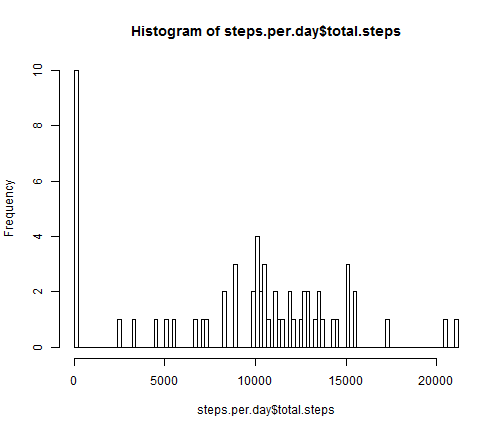

Assignment 1
========================================================

## Loading and preprocessing the data

We introduce some functions and basic operations to easily understand the problem. This will process and transform the data into a format suitable for further analysis.


```r
Sys.setlocale(category = "LC_ALL", locale = "ita")
```

```
## [1] "LC_COLLATE=Italian_Italy.1252;LC_CTYPE=Italian_Italy.1252;LC_MONETARY=Italian_Italy.1252;LC_NUMERIC=C;LC_TIME=Italian_Italy.1252"
```

```r
library(knitr)
data <- read.csv("./activity.csv")
data$day <- sapply(data$date, as.numeric)
data.cleaned <- na.omit(data)
```


## What is mean total number of steps taken per day?

Now we ignore missing values in the dataset and we create an histogram showing  the total number of steps taken each day.


```r
total_steps_per_day <- function(day) {
    sum(na.omit(data[data$day == day, ]$steps))
}
steps.per.day <- data.frame()
for (i in as.numeric(levels(factor(data$day)))) {
    steps.per.day <- rbind(steps.per.day, c(i, total_steps_per_day(i)))
}
colnames(steps.per.day) <- c("day", "total.steps")
hist(steps.per.day$total.steps, breaks = 100)
```

 


Now we report the mean and median of total number of steps taken per day:


```r
x <- c(mean(steps.per.day$total.steps), median(steps.per.day$total.steps))
x <- as.table(x)
row.names(x) <- c("Mean", "Median")
x
```

```
##   Mean Median 
##   9354  10395
```


## What is the average daily activity pattern?

We create a time series plot of the 5-minute interval (x-axis) and the average number of steps taken, averaged across all days (y-axis).


```r
steps.per.interval <- data.frame()
for (i in as.numeric(levels(factor(data.cleaned$interval)))) {
    steps.per.interval <- rbind(steps.per.interval, c(i, mean(data.cleaned[data.cleaned$interval == 
        i, ]$steps)))
}
colnames(steps.per.interval) <- c("interval", "mean.steps")
plot(steps.per.interval$interval, steps.per.interval$mean.steps, type = "l")
```

 


From the plot above easily follows that the 5-minute interval that contains the maximum number of steps is:


```r
steps.per.interval[which.max(steps.per.interval$mean.steps), ]$interval
```

```
## [1] 835
```


## Imputing missing values

As we said before, we ignored missing values. But what will change if we replace them with the mean for that 5-minute interval they are referred? Here we show some results.
First of all, the number of missing values is:


```r
sum(is.na(data))
```

```
## [1] 2304
```


Now we fill the missing value with the mean of the 5-minute interval.


```r
filled.data <- data
for (row in 1:nrow(data)) {
    if (is.na(data[row, ]$steps)) {
        filled.data[row, 1] <- mean(data.cleaned[data.cleaned$interval == data[row, 
            ]$interval, ]$steps)
    }
}
```


We create a new histogram with the filled missing values.


```r
total_steps_per_day <- function(day) {
    sum(na.omit(data[data$day == day, ]$steps))
}
filled.steps.per.day <- data.frame()
for (i in as.numeric(levels(factor(filled.data$day)))) {
    filled.steps.per.day <- rbind(filled.steps.per.day, c(i, total_steps_per_day(i)))
}
colnames(filled.steps.per.day) <- c("day", "total.steps")
hist(filled.steps.per.day$total.steps, breaks = 100)
```

 


And again we report the mean and median of total number of steps taken per day:


```r
x <- c(mean(filled.steps.per.day$total.steps), median(filled.steps.per.day$total.steps))
x <- as.table(x)
row.names(x) <- c("Mean", "Median")
x
```

```
##   Mean Median 
##   9354  10395
```


We can notice that our replacement has not changed the global result: the mean and the median of total steps taken per day is the same, and the histogram reflects this behaviour.

## Are there differences in activity patterns between weekdays and weekends?

Now we try to analyze if there are differences in activity patterns between weekdays and weekends.


```r
filled.data$day.type <- rep("weekday", nrow(filled.data))
for (row in 1:nrow(filled.data)) {
    if (weekdays(as.Date(filled.data[row, ]$date)) == "sabato" | weekdays(as.Date(filled.data[row, 
        ]$date)) == "domenica") {
        filled.data[row, ]$day.type <- "weekend"
    }
}
filled.data$day.type <- factor(filled.data$day.type)
```


Let's show these differences in a time series plot, as below:


```r
library(lattice)
steps.per.interval.in.week <- data.frame()
col <- c()
for (w in as.factor(levels(filled.data$day.type))) {
    for (i in as.integer(levels(factor(filled.data$interval)))) {
        val <- mean(filled.data[(filled.data$interval == i & filled.data$day.type == 
            w), ]$steps)
        steps.per.interval.in.week <- rbind(steps.per.interval.in.week, c(i, 
            val))
        col <- append(col, w)
    }
}
steps.per.interval.in.week <- cbind(steps.per.interval.in.week, col)
colnames(steps.per.interval.in.week) <- c("interval", "mean.steps", "day.type")
xyplot(steps.per.interval.in.week$mean.steps ~ steps.per.interval.in.week$interval | 
    steps.per.interval.in.week$day.type, layout = c(1, 2), type = "l")
```

 


As we can see, there are little differences in activity patterns between weekdays and weekends: the average number of steps taken each day is more homogeneous during weekdays, while during weekends there is a peak around the lunch time hour (800th interval).
